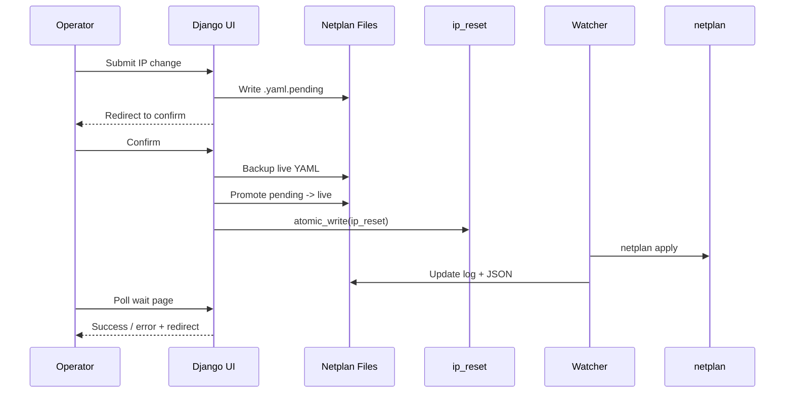

## Table of Contents
- [Situation](#situation)
- [Problem](#problem)
- [Investigation](#investigation)
- [Solution](#solution)
- [Takeaways](#takeaways)
- [UI](#UI)
- [Diagram](#diagram)
- [Final Notes](#final-notes)

---

## Situation

Changing a server’s IP address remotely is the kind of task that punishes overconfidence. One wrong route, one malformed YAML, and your remote session evaporates.

In field deployments, we don’t always have SSH access. We *do* have interface swaps, DHCP surprises, static networks that move, and gateways that mysteriously don’t belong to the same subnet.

So we built a Django-based admin workflow that lets operators safely change IP settings with:

- A strict **stage → confirm → apply** model  
- Strong validation and route guardrails  
- Atomic file operations  
- A systemd watcher that applies and logs changes  
- Clear UI feedback with timeout handling  

This is how it works.

---

## Problem

Field deployments often require:

- Switching Ethernet interfaces  
- Moving between static IP and DHCP  
- Reassigning the default interface  

Manually editing `/etc/netplan/*.yaml` is risky because:

1. A YAML mistake can drop connectivity instantly.
2. Changing the default route can kill your active session.
3. Old netplan files or cloud-init can conflict with your intended config.
4. Operators need a guided, predictable workflow — not shell roulette.

We needed:

- A UI-driven process
- Strict validation rules
- Separation between staging and applying
- Protection of the default route
- Minimal downtime
- Auditable logs

---

## Investigation

### Architecture Overview

- The Django UI validates input and stages a per-interface netplan YAML as `.yaml.pending`.
- A confirmation page acts as the **only commit point**.
- Confirm promotes pending → live and writes a signal file (`ip_reset`) atomically.
- A systemd watcher detects the signal, runs `netplan apply`, logs the result, and regenerates interface state JSON for the UI.
- The default interface is defined in `config.cnf` and enforced everywhere.

### Critical Rule

Only the default interface:

- May define a gateway  
- Must remain static  
- Cannot use DHCP  

This single constraint prevents most catastrophic lockouts.

---

## Solution

### Default Interface from `config.cnf`

The default interface is the source of truth:

```python
def get_default_interface():
    config_parser = configparser.RawConfigParser()
    config_path = os.path.join(settings.BASE_DIR, "config.cnf")

    try:
        config_parser.read(config_path)
        iface = config_parser.get("system", "eth", fallback=None)
        if iface:
            return iface.strip()
    except Exception:
        pass

    return None
````

---

### Interface Filtering

Only Ethernet-style interfaces are allowed:

```python
def get_interfaces():
    all_interfaces = os.listdir("/host_sys/class/net")
    return [
        iface for iface in all_interfaces
        if iface.startswith(("eth", "ens", "enp"))
    ]
```

The view hard-validates the selection:

```python
known_interfaces = list(get_interfaces())
if selected_interface not in known_interfaces:
    messages.error(request, f"Unknown interface '{selected_interface}'")
    return redirect("/setting#change_ip")
```

---

### File Permissions and Ownership

Staged and live YAML files are locked down:

```python
def set_permissions(filepath, mode=0o600):
    os.chmod(filepath, mode)
    os.chown(filepath, 0, 0)  # root:root
```

This ensures predictable ownership and reduces risk of accidental edits.

---

### Building Netplan Config In Memory

Before touching the filesystem:

```python
interface_config = {
    "network": {
        "version": 2,
        "renderer": "networkd",
        "ethernets": {
            selected_interface: {"optional": True}
        },
    }
}
```

#### DHCP Mode (Non-Default Only)

```python
interface_config["network"]["ethernets"][selected_interface]["dhcp4"] = True
interface_config["network"]["ethernets"][selected_interface]["addresses"] = []
interface_config["network"]["ethernets"][selected_interface]["dhcp4-overrides"] = {
    "use-routes": False,
    "route-metric": 500,
}
```

`use-routes: False` prevents DHCP from hijacking the default route.

---

#### Static Mode

```python
interface_config["network"]["ethernets"][selected_interface]["dhcp4"] = False
interface_config["network"]["ethernets"][selected_interface]["addresses"] = [ip]
```

If it’s the default interface, inject the default route:

```python
interface_config["network"]["ethernets"][selected_interface]["routes"] = [
    {"to": "0.0.0.0/0", "via": gateway}
]
```

---

### Staging Only (`.yaml.pending`)

```python
pending_path = f"/host_netplan/{selected_interface}.yaml.pending"

with open(pending_path, "w") as f:
    yaml.dump(interface_config, f, default_flow_style=False)

set_permissions(pending_path, 0o600)
```

At this point:

* No live YAML is touched.
* No `netplan apply` runs.
* No routing changes happen.

Then the UI redirects to the confirmation page.

---

### Confirmation: The Only Commit Point

On confirm:

1. Backup live YAML (if exists)
2. Promote pending → live (atomic)
3. Write `ip_reset` signal file (atomic)
4. Store session state for polling

```python
if os.path.exists(yaml_path):
    shutil.copy(yaml_path, backup_path)

os.replace(pending_path, yaml_path)

atomic_write("/code/ip_reset", sig_content)
```

Atomic write implementation:

```python
def atomic_write(path: str, content: str):
    tmp_path = f"{path}.tmp"
    with open(tmp_path, "w") as f:
        f.write(content)
        f.flush()
        os.fsync(f.fileno())
    os.replace(tmp_path, path)
```

If the default interface IP changed, the browser redirects to the new IP.

---

The watcher service:

* Monitors `ip_reset`
* Runs `netplan apply`
* Logs status to `netplan_result.log`
* Regenerates `interface_config.json`

It:

* Cleans conflicting netplan files
* Disables cloud-init networking
* Detects duplicate interface definitions
* Logs IP changes per interface
* Never crashes on failure

The systemd unit ensures resiliency:

```ini
Restart=always
RestartSec=2
StandardOutput=append:/home/.../netplan_result.log
StandardError=append:/home/.../netplan_result.log
```

---

## UI

### Interface Status Endpoint

The UI reads watcher-generated JSON:

```python
def interface_status_view(request):
    INTERFACE_CONFIG_PATH = "/code/interface_config.json"
    ...
    return JsonResponse({
        "interface": iface,
        "ip": iface_data.get("ip", ""),
        "gateway": iface_data.get("gateway", "")
    })
```

This avoids shelling out during requests.

---

### Netplan Log Polling

`check_netplan_log`:

* Reads log only if it’s newer than the change start time
* Verifies actual interface state from JSON
* Distinguishes:

  * static → must match expected IP
  * dhcp → must have some IP
  * no_ip → must be empty
* Enforces timeout
* Returns `pending`, `updated`, or `error`

State matters more than logs. If the interface matches expectation, we treat it as success even if logs are late.

---

## Diagram



---

## Takeaways

* Default interface static-only
* Gateway restricted to default interface
* DHCP route injection disabled for non-default
* Atomic writes for YAML and signal files
* `.bak` backups for rollback
* Timeout handling
* Duplicate netplan detection
* Root-owned config files
* Cloud-init networking disabled

---

### Flow

1. Navigate to Network Settings
2. Select interface
3. Choose DHCP or static
4. Enter IP/CIDR and gateway (if required)
5. Click **Save** (stages config)
6. Review confirmation page
7. Click **Confirm changes**
8. Wait page monitors apply status
9. Redirect back (or to new IP if default changed)

Downtime is typically just the duration of `netplan apply`.

---

## Final Notes

This system works because it treats network changes as a transaction:

* Stage safely
* Confirm explicitly
* Apply once
* Verify state
* Log everything

It reduces lockouts, improves auditability, and gives operators a predictable workflow without SSH access.
**Why it’s safe:**

* Default interface protected
* DHCP cannot hijack routes
* Atomic file operations
* Automatic backups
* Clear success/failure reporting
