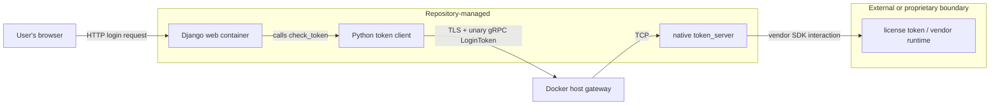
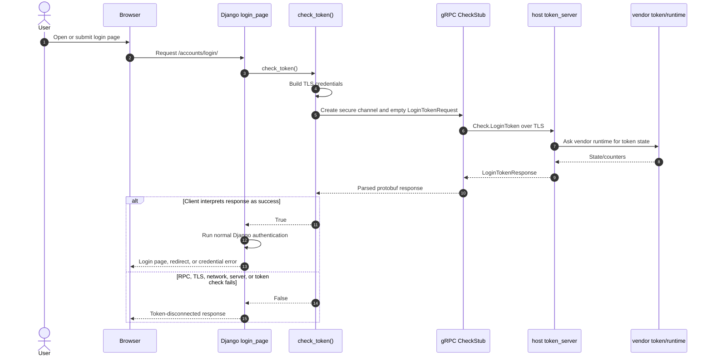
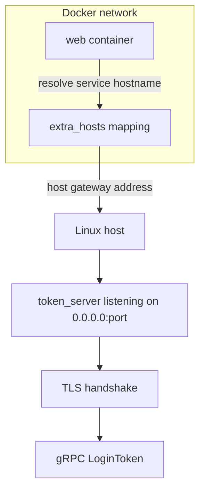
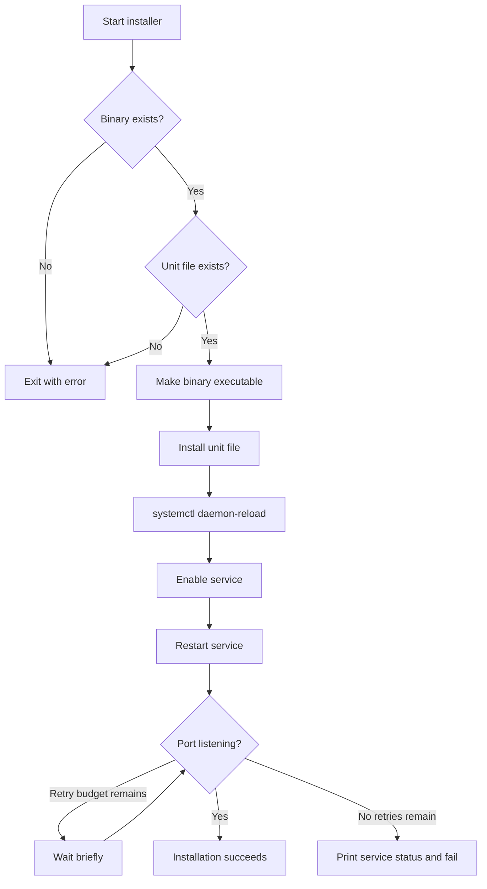
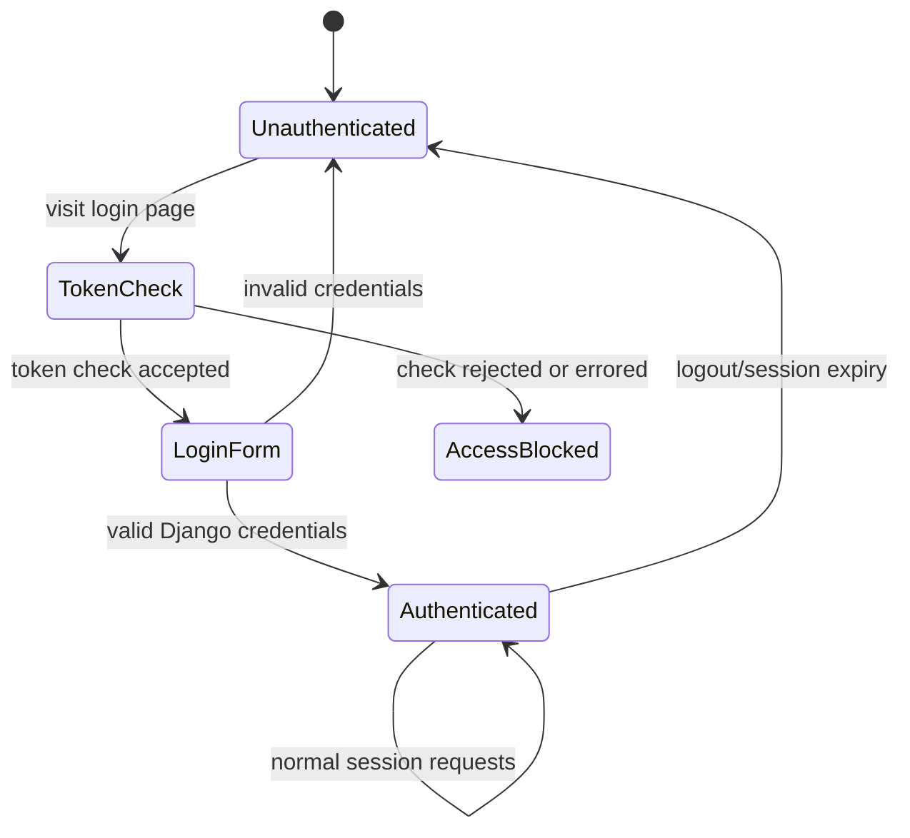
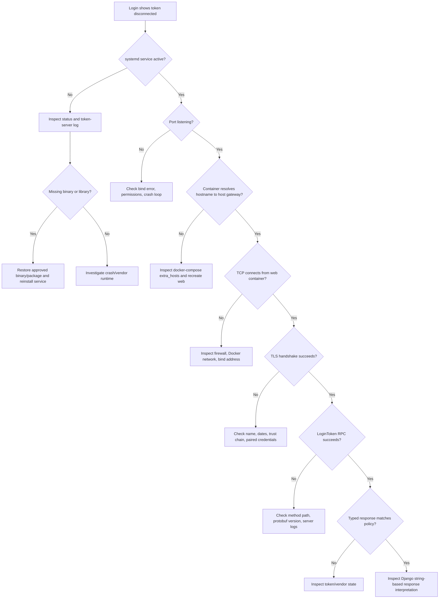
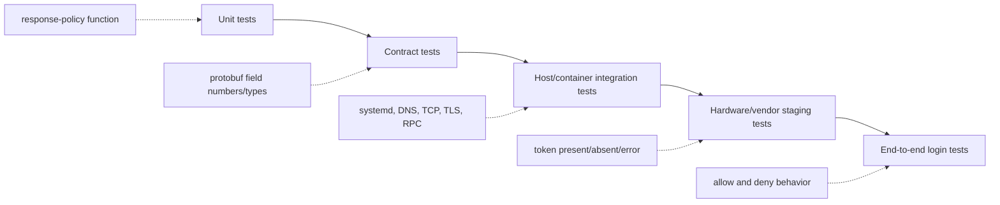
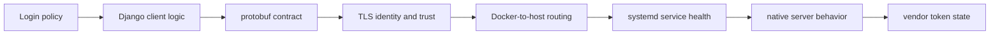

# How The Token System Works

The token system is a small licensing gate with an important job: before Django accepts an interactive login, it asks a local token service whether the required token is available. The check crosses several boundaries—browser, Django, Docker networking, TLS, gRPC, a native server, and a vendor token library—so a failure in any one of them can look like “the token is disconnected.”

This article explains those boundaries in simple terms, shows how the code fits together, and provides safe operational procedures for maintainers.

## The 60-second explanation

We have two applications involved in token validation:

1. The **Django web application** is the client. Its login view calls `check_token()`.
2. The native **`token_server` executable** is the server. It speaks gRPC over TLS, and communicates with the underlying token/vendor library.

The web container maps the token service's TLS hostname to the Docker host gateway. That lets the client use the hostname expected by the TLS certificate while traffic reaches the host-side service.

If the gRPC check succeeds according to the client's current interpretation, Django continues with normal username/password authentication. If the check fails, it raises an error and the login page returns a token-disconnected message.

This is a **fail-closed login gate**: uncertainty prevents a new login.

## Architecture at a glance



The host process and web container are deliberately separate:

- Django runs inside the `web` container.
- `token_server` runs directly on the Linux host under systemd.
- Docker's `extra_hosts` entry directs the service hostname from the container to the host gateway.
- TLS authenticates the gRPC endpoint using the service hostname, not a raw IP address.

## Simple terminology

| Term | Meaning in this project |
|---|---|
| Token | The licensing device or vendor-managed entitlement checked before login. It is not an LLM token or a Django CSRF token. |
| Client | `mainApp/accounting/token.py`, which initiates the check. |
| Server | The native `token_server/token_server` executable. |
| gRPC | A remote procedure call framework. It lets Python call a method implemented by the native server as if it were a local method. |
| RPC | One remote method call. This project uses `LoginToken`. |
| Protocol Buffers / protobuf | The binary message format and interface schema used by gRPC. |
| Stub | Generated client code that serializes a request, sends the RPC, and deserializes the response. |
| Unary RPC | One request followed by one response. There is no stream in the current contract. |
| TLS | Encryption and server authentication for the gRPC connection. |
| CA certificate | Trusted certificate material used by the client to verify the server. Never confuse it with a private key. |
| Attached/detached count | A count field reported by some versions of the protobuf/server. Its exact business meaning must be confirmed with the token vendor. |
| Fail closed | Deny access when validation cannot produce a trusted success. |
| systemd | The Linux service manager that starts, restarts, and monitors the native token server. |

## What happens during login



Important consequences:

- The token check happens in `login_page()` before username/password authentication.
- Already-authenticated requests are redirected before the token check. Existing sessions are therefore not continuously revalidated by this code path.
- The repository does not show token middleware, a periodic session recheck, or logout-on-detach behavior.
- A token that is removed after login may not affect an existing Django session until another mechanism intervenes.
- Every new unauthenticated login request can trigger a synchronous remote call.

## The gRPC contract

The generated Python schema describes one service and one method:

```text
package token_server

service Check {
    rpc LoginToken(LoginTokenRequest) returns (LoginTokenResponse)
}

LoginTokenRequest: no fields
LoginTokenResponse:
    field 1: tokenAttachedCount (integer)
    field 51: loginStatus (integer)
```

The RPC's fully qualified method path is:

```text
/token_server.Check/LoginToken
```

These facts are generated into:

- `mainApp/accounting/token_server_pb2.py`: protobuf message descriptors.
- `mainApp/accounting/token_server_pb2_grpc.py`: the `CheckStub` and `LoginToken` RPC binding.

The original `token_server.proto` file is **not present** in this repository. The Python files say they are generated and should not be edited by hand. A maintainer who changes the protocol needs the authoritative `.proto` source and the matching generation toolchain.

### A compatibility warning

The checked-in Python descriptor calls field 1 `tokenAttachedCount`. String data embedded in at least one native binary refers to a similarly numbered `tokenDettachedCount` field (including that spelling). This may indicate schema drift between binary versions.

Protobuf wire compatibility depends primarily on stable **field numbers and types**, not field names. Two sides can still exchange the integer if field 1 remains field 1, but generated code and string representations can disagree. Renumbering or changing the type would be a breaking change.

The current Django code does not compare typed values such as `response.loginStatus`. It converts the whole response to text and searches for a field name. That makes behavior dependent on protobuf string rendering and which fields are present. Treat the exact success rule as fragile until it is replaced with a documented, typed contract.

## Where the code lives

| Path | Responsibility | Maintainer notes |
|---|---|---|
| `mainApp/accounting/views.py` | Calls the token check from `login_page()` and blocks login on `False`. | This is the enforcement point visible in the repository. |
| `mainApp/accounting/token.py` | Builds TLS credentials, opens the secure gRPC channel, invokes `LoginToken`, interprets the response, and catches errors. | The function is named `check_token()`. Certificate/key material is obfuscated inline; do not expose it while debugging. |
| `mainApp/accounting/token-service-ca.pem` | Certificate material related to the token service. | Inspect metadata only in public workflows; never publish private material. The current client does not visibly load this file. |
| `mainApp/accounting/token_server_pb2.py` | Generated protobuf messages and descriptors. | Generated artifact; restore the source `.proto` before evolving it. |
| `mainApp/accounting/token_server_pb2_grpc.py` | Generated Python gRPC client/server bindings. | Django uses `CheckStub.LoginToken`. |
| `token_server/token_server` | Current host-side native server executable. | ELF x86-64 binary; source is not in this repository. |
| `token_server/token_server_v1` | An older/alternate native binary. | Do not swap versions without a compatibility and rollback test. |
| `token_server/ub20_token_server/` | Ubuntu 20-oriented binary/package artifacts. | Platform compatibility matters. |
| `token_server/*.deb` | Debian packages for the native server and its dependencies. | The package installs a binary under `/usr/bin`, while systemd currently executes the repository copy. |
| `token_server/Readme.txt` | Minimal native-server run/install notes. | Not sufficient as an operations guide. |
| `services/token-server.service` | systemd unit for the host service. | Runs the repository binary, restarts it after failure, and appends to a host log. |
| `script/install_token_server_service.sh` | Installs/enables/restarts the systemd unit and verifies certain port is listening. | Called during both initial installation and updates. |
| `tests/test_token_server_service.sh` | Tests service installation, restart ownership, executable permissions, and readiness failure. | It mocks systemd and socket inspection; it does not test a real token or gRPC exchange. |
| `docker-compose.yml` | Routes the token-service hostname from the web container to the host gateway. | The hostname must remain compatible with TLS identity verification. |
| `Makefile` | Installs package prerequisites and invokes the service installer during `up` and `update`. | Be aware that the package binary and service binary are different filesystem paths. |
| `cronjobs.sh` | Other scheduled jobs. | Token-server process ownership was removed from cron; systemd is now the single owner. |

## Networking and TLS



The hostname serves two purposes:

1. Docker name routing sends traffic from the web container to the host.
2. TLS verifies that the server certificate is valid for the requested service identity.

Replacing the hostname with an IP address can make routing work while TLS verification fails. Changing the port in only one place also fails because the following must agree:

- the native server command line in `services/token-server.service`;
- the Python gRPC target in `mainApp/accounting/token.py`;
- installer readiness checks in `script/install_token_server_service.sh`;
- service tests and operational monitoring;
- any host firewall rules.

The secure channel is configured in `token.py`. Do not “fix” a certificate problem by switching to an insecure channel. That would remove endpoint authentication and transport protection.

### Trust-material rules

- Never print or paste PEM bodies.
- Never log a private key or an expanded credential object.
- Do not commit newly generated private keys.
- Store private material with least-privilege filesystem permissions.
- Verify certificate identity, validity dates, and fingerprints through an approved secure channel before rotation.
- Rotate client trust and server credentials as one planned change with a rollback path.

## Native server lifecycle

`token-server.service` is the authoritative process owner. It:

- waits for the network-online target;
- runs the repository binary with bind address and port arguments;
- runs as `root` in the current configuration;
- restarts after failure with a short delay;
- appends stdout and stderr to `/var/log/token_server.log`;
- starts at multi-user boot after being enabled.

The installer performs this sequence:



The initial `make up` path installs the Debian package for shared-library prerequisites and then installs the systemd service. The update path reinstalls/restarts the service after the critical update pipeline. The service executes `/home/prj/token_server/token_server`, not `/usr/bin/token_server`; replacing only the package-installed copy may have no effect on the running service.

## How success and failure are currently decided

The client uses this broad flow:

```text
Build TLS credentials
    -> open secure channel
    -> create CheckStub
    -> send empty LoginTokenRequest
    -> render response as text
    -> apply current field-name check
    -> return True or False
```

Both `grpc.RpcError` and general exceptions return `False`. This is appropriate for fail-closed access, but the user-facing message does not distinguish:

- no physical/vendor token;
- server not running;
- port blocked;
- Docker hostname mapping broken;
- TLS trust or name mismatch;
- certificate expiry;
- protobuf incompatibility;
- vendor runtime/library failure;
- response interpretation bug;
- timeout or remote service hang.

Operational logs must make that distinction without revealing secrets.

### Current enforcement boundary



Notice that the diagram has no transition from `Authenticated` back to `TokenCheck` on each request. That is the observed behavior of the repository, not necessarily the intended licensing policy.

## Safe health checks

Run checks from the narrowest layer outward. Most commands below require host access; commands marked “container” run inside the web container.

### 1. Check systemd ownership and state

```bash
sudo systemctl is-enabled token-server.service
sudo systemctl is-active token-server.service
sudo systemctl status token-server.service --no-pager
```

Expected: enabled, active, and a command line pointing to the repository binary.

### 2. Check the process and listening socket

```bash
pgrep -af '/home/prj/token_server/token_server'
sudo ss -lntp '( sport = :port )'
```

A listening port proves that a process accepted a socket. It does **not** prove TLS, gRPC, the vendor token, or the success rule works.

### 3. Read recent logs without dumping the environment

```bash
sudo journalctl -u token-server.service --since '30 minutes ago' --no-pager
sudo tail -n 100 /var/log/token_server.log
docker logs --since 30m web 2>&1 | grep -E 'Token Login Status|RpcError|Exception|token is disconnect'
```

Review output before sharing it. Redact identifiers and never share expanded credentials or unrelated application configuration.

### 4. Check routing from the web container

```bash
docker exec web getent hosts token-service
docker exec web sh -c 'python - <<"PY"
import socket
with socket.create_connection(("token-service", port), timeout=3):
    print("TCP connection succeeded")
PY'
```

This confirms name resolution and TCP reachability from the same network namespace as Django. It still does not prove TLS or token validity.

### 5. Inspect certificate metadata safely

```bash
openssl x509 \
  -in mainApp/accounting/token-service-ca.pem \
  -noout -subject -issuer -dates -fingerprint -sha256
```

Do not run `cat` on certificate/key bundles in recorded sessions. Metadata is normally enough to compare the deployed trust material with an approved fingerprint.

### 6. Check native dependencies

```bash
file token_server/token_server
ldd token_server/token_server
dpkg-deb -I token_server/token_server-0.0.1-Linux.deb
```

Look for “not found” beside a required library. The current artifact family expects an x86-64 Linux system and gRPC, protobuf, OpenSSL, C/C++, and related runtime libraries. Package variants exist for different Ubuntu generations; use the artifact approved for the target OS.

### 7. Exercise the repository's service test

```bash
bash tests/test_token_server_service.sh
```

This verifies installer behavior without touching the real systemd instance. It does not validate TLS, the protobuf response, or hardware/vendor state.

### 8. Perform an end-to-end check

The safest supported end-to-end check is a login attempt in a controlled environment while watching sanitized web and token-server logs. If the organization maintains an approved gRPC diagnostic tool, call `token_server.Check/LoginToken` with an empty request using the approved CA/trust bundle. Do not bypass TLS, publish the raw response, or copy embedded credential material from `token.py` into a shell command.

An end-to-end maintenance test should prove all of the following:

- DNS/host mapping resolves from the web container.
- TCP port is reachable.
- TLS identity and trust validation succeed.
- The gRPC method exists.
- Request and response protobufs are compatible.
- The vendor runtime can inspect the token.
- Django interprets the response correctly.
- Login is allowed in the approved state and denied in a known failure state.

## Troubleshooting decision tree



### Symptom guide

| Symptom | Likely layer | First checks |
|---|---|---|
| Service inactive or restarting | Native process/systemd | `systemctl status`, token-server log, `ldd` |
| Active service but no socket | Native startup/bind | command line, port conflict, crash output |
| Socket exists on host but container cannot connect | Docker routing/firewall | `extra_hosts`, container DNS, host gateway, firewall |
| TLS verification error | Certificate/trust/name | requested hostname, certificate metadata, coordinated rotation |
| gRPC `UNAVAILABLE` | Network, TLS, server unavailable | socket, container TCP test, server logs |
| gRPC `UNIMPLEMENTED` | Contract/method mismatch | RPC path and binary/protobuf versions |
| Parsing/deserialization error | Protobuf incompatibility | field numbers/types and generated artifacts |
| RPC returns but login is blocked | Token state or client interpretation | sanitized response fields and current string check |
| Login hangs | Missing RPC deadline or stalled server | timing, process stack/vendor runtime, controlled restart |
| Existing user stays logged in after detach | Current enforcement design | expected: check is at unauthenticated login, not every request |
| Works on host, fails in container | Namespace/routing/TLS name | perform checks from inside `web` |

## Recovery runbook

Use this order to minimize unnecessary changes:

1. Record the time, affected environment, application version, token binary checksum, and symptoms. Do not record secret material.
2. Check `systemctl is-active` and the listening socket.
3. Inspect recent token-server and web logs.
4. Test hostname resolution and TCP connectivity from the web container.
5. Check certificate metadata and TLS errors.
6. Confirm the native binary's shared libraries resolve.
7. Compare the deployed binary checksum with the approved release artifact.
8. Confirm protobuf artifact versions came from the same tested release.
9. Restart only the token service if evidence points to that process:

   ```bash
   sudo systemctl restart token-server.service
   sudo systemctl status token-server.service --no-pager
   sudo ss -lntp '( sport = :port )'
   ```

10. Recreate the `web` container only if routing/configuration changed.
11. Perform a controlled login test.
12. If still failing, escalate with sanitized logs, checksums, OS/package versions, gRPC status code, and the layer at which the flow fails.

Do not repeatedly restart every service. That erases useful timing evidence and can turn a narrow failure into a wider outage.

## Safe change procedures

### Replacing the native binary

1. Obtain the artifact from the approved release channel.
2. Record and verify its checksum and target OS/architecture.
3. Confirm required shared-library versions in staging.
4. Preserve the currently approved binary as a rollback artifact outside the public repository workflow.
5. Replace `token_server/token_server`, not just `/usr/bin/token_server`.
6. Run `bash tests/test_token_server_service.sh`.
7. Run the service installer in staging.
8. Verify socket, TLS, RPC, token-present behavior, and token-absent behavior.
9. Deploy during a maintenance window and monitor both service and web logs.

Never select `token_server_v1` or the Ubuntu 20 artifact solely by filename. Prove ABI, TLS, protobuf, and vendor compatibility first.

### Changing the protobuf contract

1. Recover the authoritative `token_server.proto` into version control.
2. Document field semantics and the exact success rule.
3. Keep existing field numbers and types for compatible changes.
4. Reserve removed field numbers/names in the `.proto` file.
5. Regenerate C++ and Python artifacts using pinned tool versions.
6. Build the native server and web client from the same contract revision.
7. Test old-client/new-server and new-client/old-server combinations if rolling upgrades are possible.
8. Replace string inspection with typed field comparisons.
9. Add contract and integration tests before deployment.

### Changing hostname or port

Update and test every consumer as one change:

- `mainApp/accounting/token.py` target;
- `docker-compose.yml` host mapping;
- server TLS certificate identity;
- `services/token-server.service` bind arguments;
- `script/install_token_server_service.sh` readiness check;
- `tests/test_token_server_service.sh` expectations;
- firewall and monitoring configuration;
- operational documentation.

### Rotating TLS material

1. Inventory which file or embedded value is used by the client and which credentials are used by the server binary.
2. Generate/obtain material through the approved PKI process.
3. Verify hostname identity, validity window, key usage, and approved fingerprint.
4. Stage overlapping trust when supported.
5. Deploy server credentials and client trust in a coordinated order.
6. Verify TLS and gRPC from inside the web container.
7. Remove retired trust only after rollback and overlap windows close.

Do not place private material in this blog post, commit messages, CI output, or issue trackers.

### Changing enforcement policy

Decide the policy explicitly before changing code:

- validate only when a user signs in;
- revalidate periodically;
- validate on every protected request;
- terminate sessions after token removal;
- define a short grace period during transient outages.

Each option changes availability, load, user experience, and licensing semantics. The current code implements login-time validation only and fails closed for new login attempts.

## Testing strategy maintainers should expect



The repository currently has strong coverage for systemd installation ownership but limited visible coverage for the client policy and real RPC path. A mature suite should include:

- a pure function that maps typed response values to allow/deny;
- unit tests for allowed, denied, malformed, timeout, and exception cases;
- a contract test that locks protobuf field numbers and types;
- a fake gRPC server test for TLS and method compatibility;
- a Docker integration test for hostname-to-host routing;
- staging tests against the vendor runtime and approved token hardware;
- a browser-level login allow/deny test;
- a test proving the intended behavior for already-authenticated sessions;
- a deadline/timeout test so login cannot hang indefinitely.

## Deployment checklist

### Before deployment

- [ ] Artifact checksum matches the approved release.
- [ ] Target OS, CPU architecture, and shared libraries are compatible.
- [ ] Client and server protobuf contracts are compatible.
- [ ] TLS hostname, trust, and validity window are verified.
- [ ] No secret or certificate body appears in the change, logs, or review notes.
- [ ] Service installer test passes.
- [ ] Token-present and token-absent behavior pass in staging.
- [ ] A known-good rollback binary and configuration are available.

### During deployment

- [ ] Run the normal project update path so the systemd unit is reinstalled/restarted.
- [ ] Confirm `token-server.service` is active.
- [ ] Confirm port is listening.
- [ ] Confirm routing and TCP access from the web container.
- [ ] Confirm TLS and `LoginToken` succeed.
- [ ] Perform one controlled successful and one controlled denied login scenario.

### After deployment

- [ ] Watch sanitized token-server and web logs.
- [ ] Confirm systemd is the only token-server process owner.
- [ ] Confirm no crash loop or repeated login latency.
- [ ] Record deployed checksums and versions in the private operations system.
- [ ] Remove temporary diagnostics and securely handle any sensitive output.

## Rollback

Rollback must restore a tested **set**, not an arbitrary single file:

- native binary;
- matching protobuf Python artifacts;
- compatible TLS/trust configuration;
- systemd unit and port;
- Docker hostname mapping;
- Django response interpretation.

After restoring the approved set:

```bash
sudo systemctl daemon-reload
sudo systemctl restart token-server.service
sudo systemctl status token-server.service --no-pager
sudo ss -lntp '( sport = :port )'
bash tests/test_token_server_service.sh
```

Then repeat the container routing, TLS/RPC, and controlled login checks. A listening socket alone is not enough to declare rollback successful.

## Security and reliability observations

These are maintainership risks visible from the repository, not disclosures of secret values:

1. **Credential material is embedded/obfuscated in Python.** Obfuscation is not secret management. Anyone with runtime/code access may be able to recover it.
2. **The native server is a binary without source here.** Maintainers cannot fully audit its token logic, TLS setup, dependency behavior, or vendor-library calls.
3. **The original `.proto` is missing.** Generated code is acting as the only checked-in client contract.
4. **Response policy is string-based.** A field-name/rendering change can alter access behavior without a meaningful wire-level change.
5. **No explicit RPC deadline is visible.** A stalled call can delay login longer than intended.
6. **Logging may include the full protobuf response.** Treat response data as potentially sensitive and log only the fields needed for operations.
7. **The service runs as root and binds all interfaces.** Confirm whether vendor hardware access requires root and whether host firewall rules adequately restrict exposure.
8. **The same port is used on host and client.** This is simple, but port changes must be coordinated across several files.
9. **Package and runtime paths differ.** The Debian package installs one binary, while systemd launches the repository copy.
10. **Validation is login-time only.** Existing sessions are not visibly revoked when the token becomes unavailable.
11. **The UI collapses all failures into one message.** Operators need logs/metrics to distinguish entitlement failure from infrastructure failure.
12. **Certificate sources appear duplicated.** A PEM file exists, while the client builds credentials from inline values; establish one authoritative, rotatable source.

### Recommended improvement order

1. Document the vendor-approved success semantics for `loginStatus` and count fields.
2. Restore/version the authoritative `.proto` and native server source or build provenance.
3. Replace string matching with typed response validation and tests.
4. Add a short explicit RPC deadline and structured, sanitized error logging.
5. Move credential material to a protected runtime secret with a documented rotation process.
6. Add a real TLS/gRPC integration test and controlled token-present/token-absent staging test.
7. Decide and document session behavior after token removal.
8. Evaluate least privilege, socket exposure, and firewall restrictions for the native service.
9. Remove ambiguity between package-installed and repository-managed binaries.
10. Add metrics for request latency, gRPC status class, server readiness, and denied checks without logging sensitive payloads.

## What is verified, inferred, and unknown

### Verified from repository artifacts

- Django calls `check_token()` from the unauthenticated login flow.
- Failure blocks the login page before normal credential authentication.
- The client uses a secure gRPC channel and invokes `Check.LoginToken` with an empty request.
- Generated Python protobuf code defines integer response fields.
- The native executable is an x86-64 ELF binary linked to gRPC, protobuf, and TLS libraries.
- The host service listens on port and is managed by systemd.
- The web container maps the service hostname to the host gateway.
- Installation and update paths invoke the token-service installer.
- The installer considers the service ready when the TCP port is listening.

### Reasonable inference

- The native process bridges gRPC to a proprietary licensing/token runtime; native symbols and project layout support this interpretation.
- Attached/detached counters represent vendor token connection state, but exact meanings and acceptable values are not documented here.
- TLS identity is tied to the service hostname used by the Python client.

### Unknown without vendor/source documentation

- What physical or logical token technology is used.
- The vendor SDK API, return-code meanings, and retry behavior.
- The authoritative meaning of `loginStatus` and the count field values.
- Whether multiple tokens are supported and how counts should affect access.
- How the server obtains, caches, refreshes, or releases a token session.
- Whether the server's TLS private credentials are embedded or loaded externally.
- Whether the vendor requires root privileges.
- Thread safety, concurrency limits, rate limits, and token-session lifetime.
- Intended behavior when a token is removed after users have logged in.
- The build procedure and reproducible source revision for each native binary.

Do not turn these unknowns into assumptions in production code. Resolve them with the vendor or original implementers and capture the answers in a private operational specification when they include sensitive detail.

## Maintainer quick reference

```text
Enforcement point:  mainApp/accounting/views.py -> login_page()
Client function:    mainApp/accounting/token.py -> check_token()
RPC:                token_server.Check/LoginToken
Request:            LoginTokenRequest (empty)
Response:           integer status/count fields (semantics need confirmation)
Transport:          gRPC over TLS
Host service:       token-server.service
Runtime binary:     /home/prj/token_server/token_server
Listen port:        port/TCP
Container route:    service hostname -> Docker host gateway
Primary host log:   /var/log/token_server.log
Installer:          script/install_token_server_service.sh
Focused test:       bash tests/test_token_server_service.sh
Failure policy:     fail closed for new login attempts
Session policy:     no continuous token recheck visible in this flow
```

### Five commands to start an incident

```bash
sudo systemctl status token-server.service --no-pager
sudo ss -lntp '( sport = :port )'
sudo tail -n 100 /var/log/token_server.log
docker exec web getent hosts token-service
docker exec web sh -c 'python - <<"PY"
import socket
with socket.create_connection(("token-service", port), timeout=3):
    print("TCP connection succeeded")
PY'
```

These locate the failing layer; they do not by themselves prove token validity.

## Final mental model

Think of the system as a chain of trust:



A login is allowed only when every link works and the final response is interpreted as acceptable. Good maintenance means diagnosing one link at a time, keeping client/server contracts synchronized, treating credentials as secrets, and testing both the allowed and denied paths after every meaningful change.
