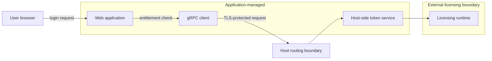
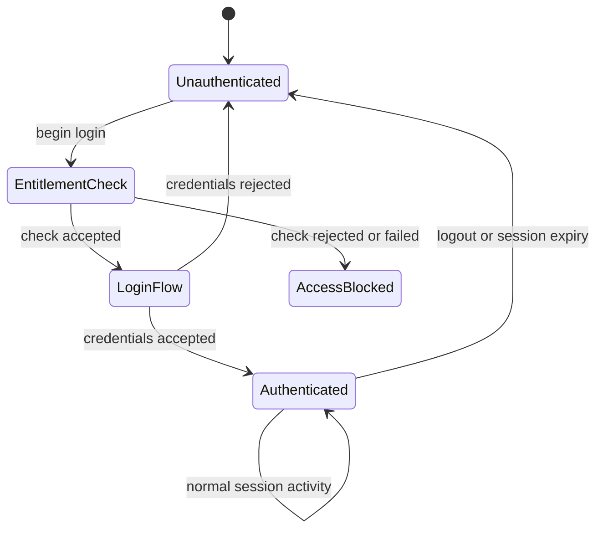
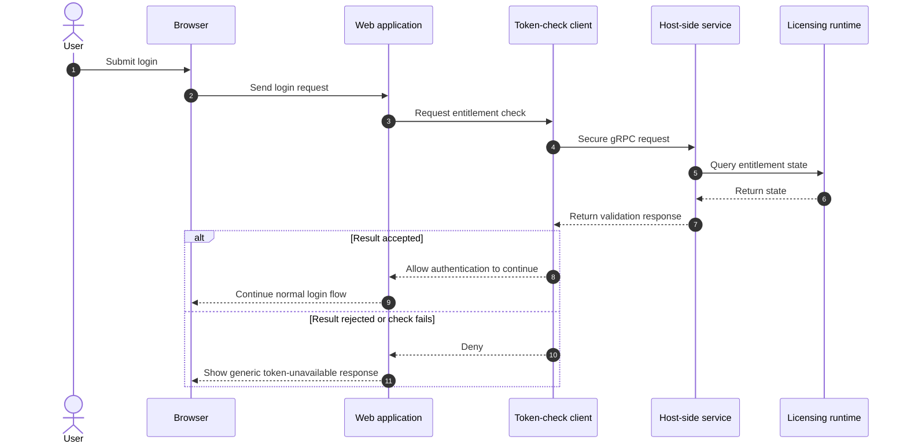
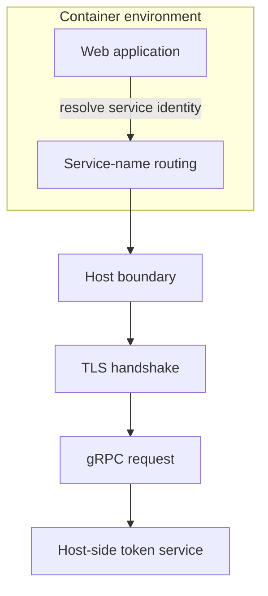
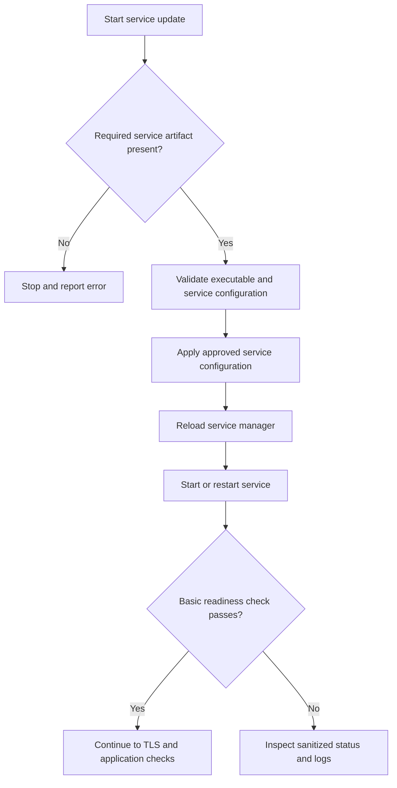
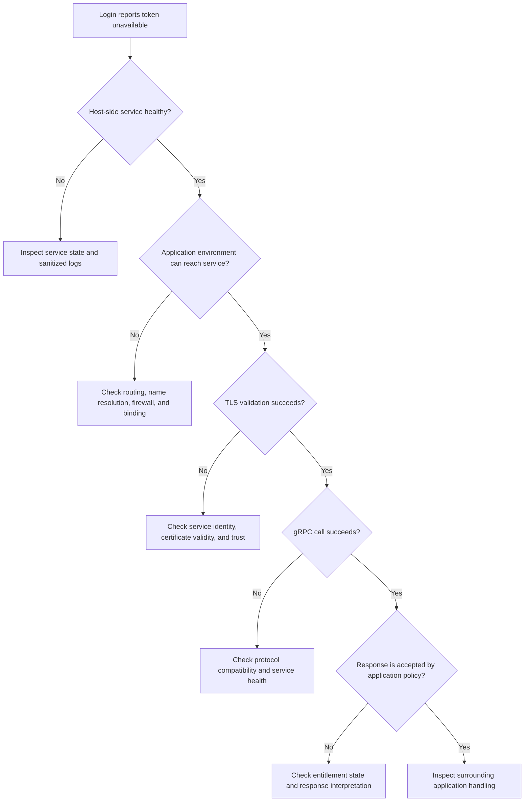
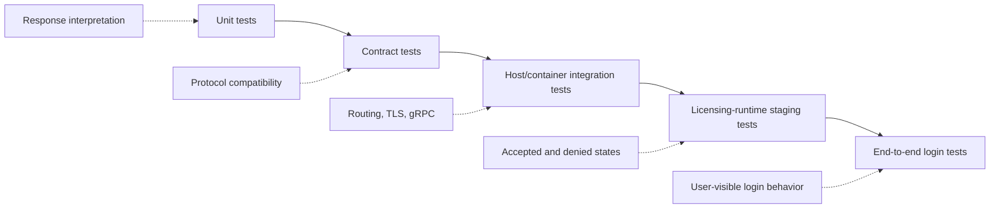
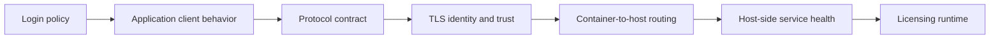

# How the Token System Works

Before the web application accepts a new interactive login, it checks whether the required licensing entitlement is available. That sounds simple, but the check crosses several technical layers: the application, container networking, TLS, gRPC, a host-side service, and the licensing runtime behind it.

That layering matters when something goes wrong. A user may only see a message saying that the token is unavailable, while the actual problem could be network reachability, certificate validation, service health, protocol compatibility, or the licensing system itself.

This post describes the system at a public, architectural level. Implementation-specific identifiers, commands, file locations, schemas, credential material, and internal operating procedures are intentionally omitted.

## The basic flow

There are two main application-side roles.

The web application acts as the client. During login, it asks a host-side token service to validate the required entitlement. The token service handles the gRPC request and talks to the underlying licensing runtime.

The gRPC connection is protected with TLS. The application connects using the service identity expected by the certificate, while container networking routes that connection to the service running on the host.

If the token check returns an accepted result, the application continues with its normal username and password authentication. If the check fails, or if the result cannot be trusted, the new login is denied.

In other words, the login gate fails closed. An uncertain licensing result is treated as a failed check rather than an implicit success.

## Architecture at a glance

The diagram is intentionally generic. It shows the trust and transport boundaries without exposing internal hostnames, ports, RPC names, paths, or vendor-specific interfaces.

## A few terms used in this post

A **token** here means a licensing device or vendor-managed entitlement. It has nothing to do with LLM tokens or CSRF tokens.

The **client** is the application component that initiates the validation request. The **server** is the service that receives it.

**gRPC** is a remote procedure call framework. It allows one process to invoke an operation exposed by another process through a defined interface.

**Protocol Buffers**, usually shortened to protobuf, provide the message format and interface schema commonly used with gRPC. Generated client bindings handle serialization, transport, and deserialization.

This system uses a request-and-response style of RPC rather than streaming.

**TLS** protects the connection and allows the client to verify the identity of the server. The client trusts certificate material used for verification; private key material must remain private.

The host-side service is managed by **systemd** in the deployment described here.

## What happens when someone signs in

A new login starts in the web application. Before normal credential authentication completes, the application performs the licensing check.

The client establishes a secure gRPC connection to the token service. The service then asks the licensing runtime for the current entitlement state and returns a response to the application. The application interprets that response according to its access policy.

A successful check lets the normal authentication flow continue. A rejected result, transport error, TLS problem, service error, incompatible response, or unexpected exception results in a denied login.

This also means that licensing behavior and session behavior are separate questions. A check performed during login does not automatically imply continuous revalidation of an existing authenticated session. Whether active sessions are checked again depends on the surrounding session design.

This diagram describes the public behavioral boundary only. It does not disclose the application's internal function names, middleware structure, or session implementation.

A fresh unauthenticated login can also involve a synchronous remote call, so service latency and timeouts can affect the login experience.

## gRPC and protobuf compatibility

The public detail that matters most is that the client and server must agree on the protocol contract.

With protobuf, wire compatibility depends heavily on stable field numbers and compatible types. Renumbering a field or changing its type can break communication even when the code still looks structurally similar.

Generated client and server bindings should therefore come from compatible versions of the same authoritative schema.

Application code should also interpret protobuf responses through typed fields with documented meaning. Converting an entire protobuf message to text and then searching that text for names is fragile because text rendering is not the wire contract.

The exact service names, method names, message definitions, response fields, and business rules are implementation details and are not included here.

## Networking and TLS

The token service runs on the host while the web application runs in a container. The application still needs to address the service by the identity that matches its TLS certificate.

That creates two separate requirements. First, container networking must route the service name to the correct host-side destination. Second, TLS must verify that the certificate is valid for the name the client requested.

A connection can therefore be reachable at the TCP level and still fail during TLS verification.

The same is true of other configuration changes. Client and server settings have to remain consistent with the network and certificate setup. A partial change can leave one layer working while another layer fails.

Switching to an insecure gRPC connection is not an appropriate way to solve a certificate problem. Doing so removes server authentication and transport protection instead of fixing the underlying trust issue.

Certificate and key material also need different handling. Public diagnostics should use non-secret metadata where possible. Private keys, complete credential objects, and raw secret material should never be placed in public logs, tickets, blog posts, or recorded troubleshooting sessions.

## The host-side service

The native token service is a separate process from the containerized web application. In this deployment it is managed by systemd, which owns its normal start, stop, restart, and boot-time lifecycle.

Service health has more than one layer. A running process or listening socket only proves that the operating system has a process accepting connections. It does not prove that TLS succeeds, that the expected gRPC operation is available, that protobuf messages are compatible, or that the licensing runtime can return a usable result.

This distinction is useful during troubleshooting because it prevents a common mistake: treating an open port as proof that the whole token check is healthy.

It is also important to know which deployed service artifact is actually being executed. If more than one copy or packaging path exists, updating a different copy will not change the running process. Exact artifact locations and update procedures are intentionally left out of this public version.

A typical service update follows a simple validation sequence rather than assuming that a successful file copy means the service is healthy:

The exact installer logic, file locations, arguments, retry values, and readiness commands are intentionally omitted.

## Why a token check can fail

The message shown to the user may be deliberately simple, but several different failures can sit behind it.

The entitlement itself may be unavailable. The host-side service may be stopped, unhealthy, or unable to reach the licensing runtime. Container routing can fail, a firewall can block the connection, or the service can be bound somewhere the application cannot reach.

TLS adds another set of possibilities, including certificate expiration, an untrusted certificate chain, or a hostname mismatch.

At the gRPC and protobuf layer, the client and server may disagree about the available operation or message contract. The call can also time out or return a result the application cannot interpret correctly.

Because these failures occur at different layers, troubleshooting is more reliable when each layer is checked separately instead of changing several things at once.

## A safer way to troubleshoot

Start with the service itself. Confirm that the expected service is running normally and that the host is actually accepting connections for it.

Next, check the path from the same network environment as the web application. Host-level connectivity alone is not enough when the application runs in a container.

Once basic reachability is established, verify TLS identity and trust. Certificate metadata can usually answer questions about the expected identity, issuer, validity window, and fingerprint without exposing secret key material.

After that, test the gRPC layer and the protocol contract using approved internal diagnostics. A successful TCP connection does not prove that the expected RPC exists or that the client can parse its response.

Finally, test the actual application behavior in a controlled environment. A useful end-to-end check covers both an accepted licensing state and a known denied state.

The public version of this post does not include shell commands, internal diagnostic tools, endpoint identifiers, paths, filenames, or exact recovery procedures.

## Reading common symptoms

Some symptoms point strongly toward a particular layer.

If the host service is inactive or repeatedly restarting, the problem is likely in the native process, its dependencies, permissions, or the licensing runtime it uses.

If the service is running but the application cannot reach it from inside the container, focus on container routing, name resolution, firewall rules, and the service's network binding.

A TLS verification error usually means the connection reached the TLS layer, but the requested service identity, certificate validity, or trust chain did not pass verification.

A gRPC availability error can still come from networking, TLS, or server health. An error indicating that an operation is not implemented points more directly to a client/server contract mismatch.

Deserialization failures are a sign to compare protobuf compatibility. If the RPC succeeds but login is still denied, the problem may be the licensing state or the way the application interprets the response.

A login that waits indefinitely suggests that a remote call may be stalled or that a deadline is missing or ineffective.

If a user remains signed in after the entitlement changes, that does not necessarily mean the token check is broken. It may simply mean the system validates new logins but does not continuously revalidate existing sessions.

## Recovery without making the incident worse

When diagnosing this kind of problem, record enough context to reproduce the failure without collecting secrets. Useful context includes the affected environment, application version, service state, relevant software versions, and the time the problem occurred.

Then work through the layers in order: service health, connectivity from the application environment, TLS, gRPC compatibility, licensing state, and application interpretation.

Changes should follow the evidence. Restarting every related service at once can erase useful timing information and make the original failure harder to isolate.

If a service restart is justified, verify its health again afterward and repeat the relevant connectivity and application checks. Recreate containers only when routing or configuration changes actually require it.

If the problem remains, escalation material should be sanitized. It can include error classes, software versions, checksums of approved artifacts, and the layer where the failure occurs. It should not contain credentials, private keys, raw entitlement data, or internal secrets.

## Making changes safely

A native service update should come from an approved release source and be checked for the target operating system, architecture, and required runtime dependencies. The currently known-good version should remain available for rollback until the new version has passed staging and production checks.

Protocol changes need similar discipline. The authoritative protobuf schema should be versioned, existing field numbers and compatible types should be preserved where compatibility is required, and generated bindings should be produced with controlled tooling.

Rolling upgrades deserve extra attention because old and new client/server combinations may coexist during deployment. Compatibility tests should cover the combinations that can actually occur.

Network identity changes must be coordinated with TLS. A new hostname or connection setting affects routing, certificate identity, and the other configuration that depends on them. Those pieces have to stay consistent.

TLS rotation should be treated as a coordinated trust change. New material should be verified through the organization's approved process, staged with overlap when possible, and removed only after the new trust path is confirmed and the rollback window has closed.

The exact internal deployment sequence, certificate sources, artifact locations, service arguments, automation, and rollback commands are not included here.

## Testing the system

Unit tests can verify how the application maps a typed licensing response to an allow or deny decision. They should also cover malformed responses, errors, and timeouts.

Contract tests can detect incompatible protobuf changes before deployment. Integration tests can cover container-to-host connectivity, TLS, and gRPC compatibility without relying only on process-level checks.

Staging should exercise the real licensing runtime in both accepted and denied states. Browser-level tests are useful because they verify the behavior a user actually sees, including the intended treatment of already-authenticated sessions.

Timeout behavior deserves its own test. A licensing check should not leave the login flow hanging indefinitely if the remote service stops responding.

These testing layers answer different questions, so passing one of them should not be treated as proof that all of the others are healthy.

## Deployment and rollback

Before deployment, verify that the intended client and server versions are compatible, the runtime environment is supported, TLS trust is valid, and no secret material has entered logs or review notes.

During deployment, confirm that the host-side service starts normally and that the application can reach and authenticate it from the container environment. Then verify the gRPC call and perform controlled accepted and denied login tests.

After deployment, watch for crashes, repeated connection failures, unusual login latency, or unexpected denial patterns. Record the deployed versions and approved artifact checksums in the private operations system.

Rollback should restore a known-compatible set of components rather than an arbitrary single artifact. The service, protocol bindings, trust configuration, network settings, and application-side interpretation all need to remain mutually compatible.

After rollback, repeat the same layered checks. A running process and an open socket are necessary signals, but they are not enough on their own.

## Security and reliability points worth keeping in mind

Credential material should not be embedded in application code. Obfuscation is not a substitute for secret management because anyone with sufficient runtime or code access may still be able to recover embedded values.

Native artifacts need traceable build provenance. Without a reliable link to the source and build process, maintainers cannot fully audit the service's behavior or dependencies.

The protobuf schema should remain the source of truth for the wire contract. Generated code should not become the only surviving definition of that contract.

Response handling should use typed, documented semantics. A formatting change in a generated message should never change an access decision.

Remote calls need explicit deadlines so a stalled dependency cannot block login indefinitely.

Logs should contain only the information needed to diagnose the problem. Licensing responses and vendor-runtime data may themselves be sensitive.

The native service should run with only the privileges and network exposure it needs.

Ownership of deployed artifacts should be unambiguous. Maintainers need to know which version is actually running and how it was produced.

Session behavior also needs an explicit definition. Checking entitlement at login is different from continuously validating entitlement during an active session.

Finally, a generic message for users can coexist with more specific private telemetry for operators. The public message does not need to expose the internal reason for a failed licensing check.

## What can be verified, and what still needs authoritative documentation

Some parts of the system can be confirmed directly from controlled application and deployment artifacts. Maintainers can verify where the login-time check occurs, whether a failed check blocks authentication, whether the client uses TLS, whether the deployed client and server contracts are compatible, whether the host service is managed by systemd, and whether the application can route to it from the container environment.

Other points may be reasonable technical inferences but should not be treated as documented facts. For example, a native service may clearly bridge the application's gRPC call to a licensing runtime, while the exact business meaning of the licensing data can still depend on vendor or internal documentation.

Several questions should remain explicitly unknown until an authoritative source answers them. These can include the exact token technology, vendor API behavior, retry rules, multi-token behavior, caching or lifetime rules, required privileges, concurrency limits, the intended response to entitlement removal during an active session, and the reproducible build details for native artifacts.

Unknowns should stay unknown in public documentation. If an operational decision depends on one of them, resolve it through the appropriate internal or vendor documentation and record the answer in a private specification.

## Putting the layers together

The login check is a chain of dependencies. Application policy relies on the client understanding the protocol response. The protocol relies on a working TLS connection, which in turn relies on the correct network path and service identity. The host service has to be healthy, and the licensing runtime has to return a result the application can use.

If any of those layers fails, the application may still report only that the token is unavailable. When that happens, treat the message as the start of the diagnosis rather than the diagnosis itself. Find the failing layer, keep the client and server contract compatible, protect credential material, and retest both accepted and denied login cases after a meaningful change.
