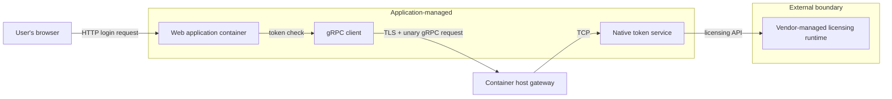
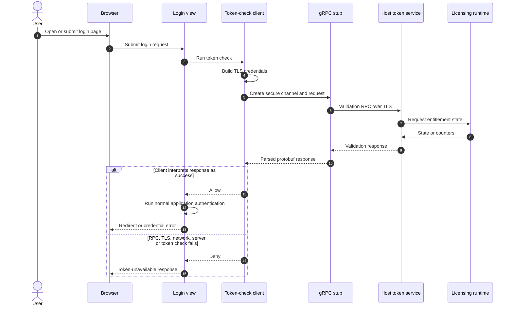
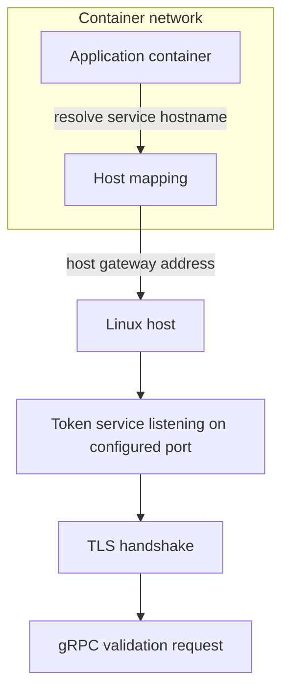
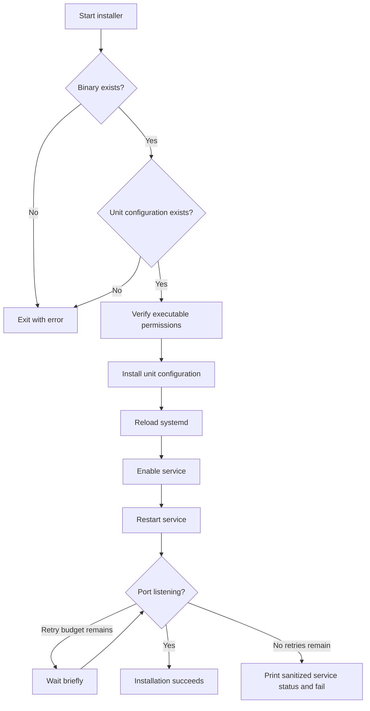
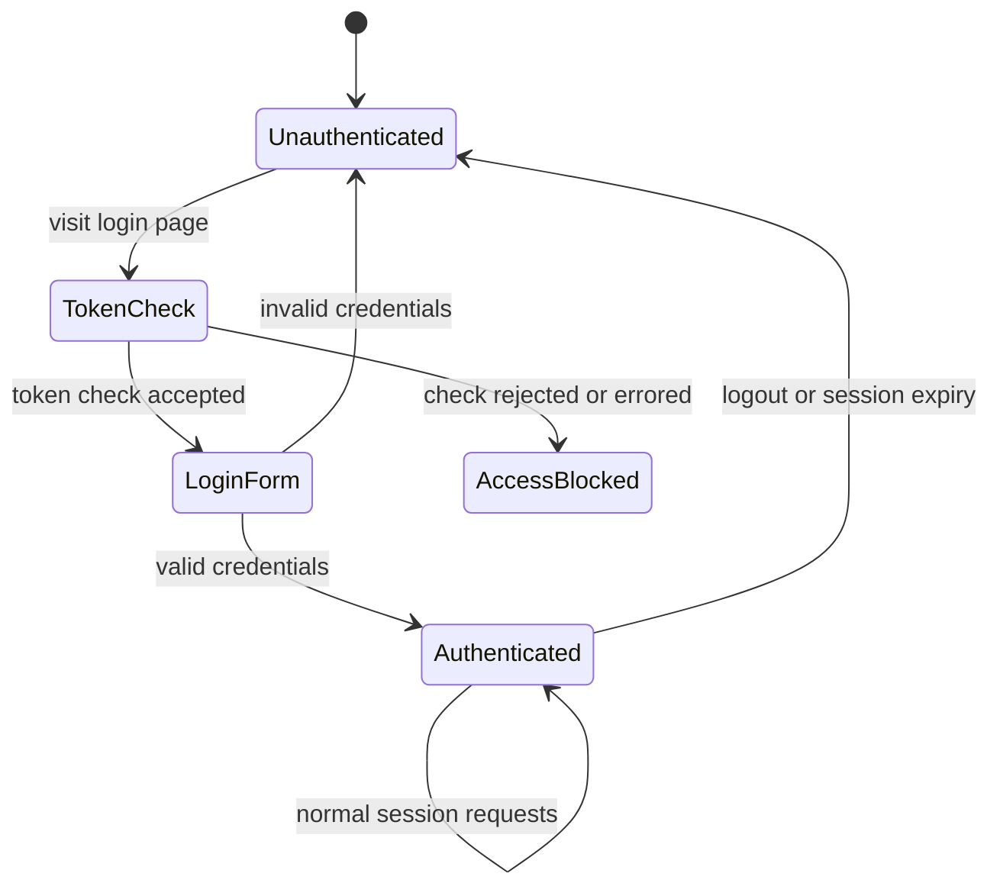
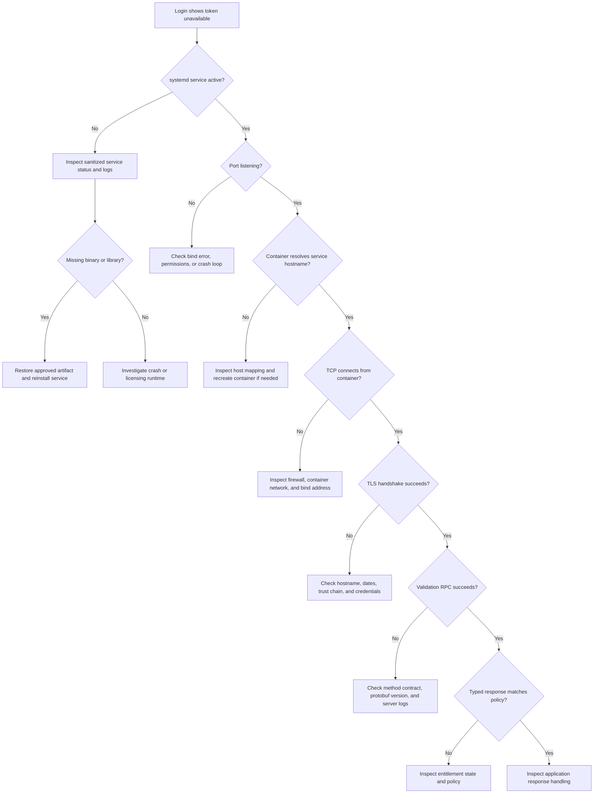
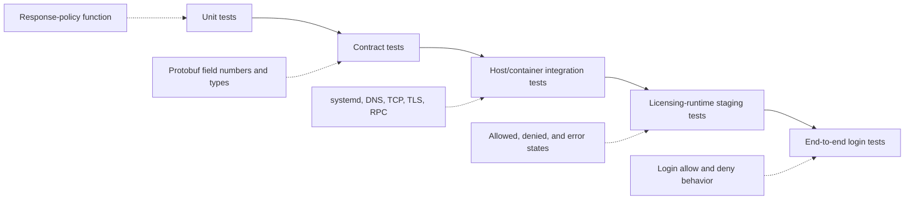
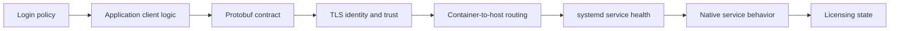

# How the Token System Works

The token system is a small licensing gate with an important job: before the web application accepts an interactive login, it asks a local token service whether the required entitlement is available. The check crosses several boundaries—browser, web application, container networking, TLS, gRPC, a native service, and a vendor-managed licensing runtime—so a failure in any one of them can look like “the token is disconnected.”

This article explains those boundaries in simple terms, shows how the pieces fit together, and provides safe operational procedures for maintainers.

> **Public-sharing note:** Names, paths, ports, RPC identifiers, field names, and other implementation-specific details in this article are intentionally generalized. Replace the examples with your approved internal values when using the runbook privately.

## The 60-second explanation

Two applications are involved in token validation:

1. The **web application** is the client. Its login flow calls a token-check helper.
2. A native **token service** is the server. It speaks gRPC over TLS and communicates with the underlying licensing runtime.

The container maps the token service's TLS hostname to the host gateway. This lets the client use the hostname expected by the TLS certificate while traffic reaches the host-side service.

If the gRPC check succeeds according to the client's policy, the application continues with normal username/password authentication. If the check fails, login is blocked and the user sees a token-unavailable message.

This is a **fail-closed login gate**: uncertainty prevents a new login.

## Architecture at a glance



The host process and container are deliberately separate:

- The web application runs inside the container.
- The token service runs directly on the Linux host under systemd.
- Container host mapping directs the service hostname to the host gateway.
- TLS authenticates the gRPC endpoint using the service hostname, not a raw IP address.

## Simple terminology

| Term | Meaning |
|---|---|
| Token | A licensing device or vendor-managed entitlement checked before login. It is not an LLM token or a CSRF token. |
| Client | The application component that initiates the validation request. |
| Server | The native service that exposes the validation RPC. |
| gRPC | A remote procedure call framework. It lets one process call a method implemented by another process through a defined interface. |
| RPC | One remote method call. This system uses a single validation call during login. |
| Protocol Buffers / protobuf | The binary message format and interface schema commonly used by gRPC. |
| Stub | Generated client code that serializes a request, sends the RPC, and deserializes the response. |
| Unary RPC | One request followed by one response. There is no stream in the current design. |
| TLS | Encryption and server authentication for the gRPC connection. |
| CA certificate | Trusted certificate material used by the client to verify the server. It is not a private key. |
| Status/count fields | Response values reported by some versions of the client/server contract. Their business meaning should be documented explicitly. |
| Fail closed | Deny access when validation cannot produce a trusted success. |
| systemd | The Linux service manager that starts, restarts, and monitors the native token service. |

## What happens during login



Important consequences:

- The token check happens before username/password authentication.
- Already-authenticated requests may bypass this token check, depending on the surrounding session logic.
- If there is no middleware or periodic revalidation, removing a token after login may not affect an existing session immediately.
- Every new unauthenticated login request can trigger a synchronous remote call.

## The gRPC contract

At a high level, the contract contains one validation service and one unary method:

```text
service TokenService {
    rpc ValidateToken(ValidateTokenRequest) returns (ValidateTokenResponse)
}

ValidateTokenRequest:
    no application fields

ValidateTokenResponse:
    integer status/count fields
```

This is a deliberately simplified public representation. Keep the authoritative `.proto` file and generated bindings synchronized in the private repository.

### Compatibility warning

Protobuf wire compatibility depends primarily on stable **field numbers and types**, not field names. Renumbering a field or changing its type is a breaking change unless a migration strategy explicitly supports it.

Avoid interpreting a protobuf response by converting the entire message to text and searching for field names. String rendering is an implementation detail and can change across generated-code or schema versions. Prefer typed field comparisons backed by documented business semantics and tests.

## Where the code lives

For public documentation, describe responsibilities rather than internal paths:

| Component | Responsibility | Maintainer notes |
|---|---|---|
| Login view | Calls the token check and blocks login when validation fails. | This is the application enforcement point. |
| gRPC client module | Builds TLS credentials, opens the secure channel, invokes the validation RPC, interprets the response, and handles errors. | Do not expose embedded or runtime credential material while debugging. |
| CA/trust material | Lets the client verify the token service certificate. | Publish metadata only when appropriate; never publish private keys. |
| Generated protobuf messages | Defines request and response descriptors. | Generated code should come from the authoritative schema. |
| Generated gRPC bindings | Defines the client stub and RPC binding. | Regenerate it with pinned tooling when the schema changes. |
| Native token service | Hosts the gRPC endpoint and bridges to the licensing runtime. | Treat binaries and build provenance as controlled artifacts. |
| systemd unit | Starts and monitors the host-side service. | Keep restart behavior, privileges, and logging intentional. |
| Service installer | Installs or updates the service and performs readiness checks. | A listening socket is only a basic readiness signal. |
| Service tests | Exercise installer, lifecycle, permissions, and failure handling. | Add real TLS/gRPC integration tests separately. |
| Container configuration | Routes the service hostname to the host gateway. | The hostname must remain compatible with TLS identity verification. |
| Build/update automation | Installs prerequisites and invokes the service installer. | Avoid ambiguity between packaged and runtime-managed binaries. |

## Networking and TLS



The hostname serves two purposes:

1. Container routing sends traffic from the container to the host.
2. TLS verifies that the server certificate is valid for the requested service identity.

Replacing the hostname with an IP address can make routing work while TLS verification fails. Changing the port in only one place can also break the flow because the following must agree:

- the native service's bind configuration;
- the gRPC client's target;
- installer readiness checks;
- service tests and operational monitoring;
- host firewall rules.

Do not “fix” a certificate problem by switching to an insecure gRPC channel. That would remove endpoint authentication and transport protection.

### Trust-material rules

- Never print or paste PEM bodies into public logs or tickets.
- Never log a private key or an expanded credential object.
- Do not commit newly generated private keys.
- Store private material with least-privilege filesystem permissions.
- Verify certificate identity, validity dates, and fingerprints through an approved secure channel before rotation.
- Rotate client trust and server credentials as one planned change with a rollback path.

## Native service lifecycle

The systemd unit should be the authoritative process owner. In a typical deployment, it:

- waits for network readiness;
- runs the approved binary with bind-address and port arguments;
- uses only the privileges required by the licensing runtime;
- restarts after unexpected failure according to a defined policy;
- writes logs to an approved location or journal;
- starts at boot after being enabled.

A typical installer performs this sequence:



If both a package-installed binary and an application-managed binary exist, document which one systemd actually executes. Updating the wrong copy can leave the running service unchanged.

## How success and failure are decided

The client uses this broad flow:

```text
Build TLS credentials
    -> open secure channel
    -> create gRPC stub
    -> send validation request
    -> parse typed response
    -> apply documented policy
    -> allow or deny
```

RPC errors and unexpected exceptions should fail closed. The user-facing message, however, often cannot distinguish among causes such as:

- no available entitlement;
- service not running;
- port blocked;
- container host mapping broken;
- TLS trust or hostname mismatch;
- certificate expiration;
- protobuf incompatibility;
- licensing-runtime failure;
- response interpretation bug;
- timeout or remote-service hang.

Operational logs should distinguish these cases without revealing secrets.

### Current enforcement boundary



If there is no transition from `Authenticated` back to `TokenCheck` during normal requests, token validation is login-time only rather than continuous.

## Safe health checks

Run checks from the narrowest layer outward. The commands below use intentionally generic example values; replace them with approved internal values before use.

```bash
SERVICE_UNIT='example-token.service'
SERVICE_PROCESS='/path/to/token-service'
SERVICE_HOST='token-service.example.internal'
CONTAINER='web'
PORT=12345
SERVICE_LOG='/path/to/token-service.log'
CERT_FILE='/path/to/ca-cert.pem'
BINARY='/path/to/token-service'
PACKAGE='/path/to/token-service-package.deb'
TEST_SCRIPT='./path/to/service-test.sh'
```

### 1. Check systemd ownership and state

```bash
sudo systemctl is-enabled "$SERVICE_UNIT"
sudo systemctl is-active "$SERVICE_UNIT"
sudo systemctl status "$SERVICE_UNIT" --no-pager
```

Expected: enabled, active, and a command line pointing to the approved runtime binary.

### 2. Check the process and listening socket

```bash
pgrep -af "$SERVICE_PROCESS"
sudo ss -lntp "( sport = :$PORT )"
```

A listening port proves that a process has bound a socket. It does **not** prove that TLS, gRPC, the licensing runtime, or the success rule works.

### 3. Read recent logs without dumping the environment

```bash
sudo journalctl -u "$SERVICE_UNIT" --since '30 minutes ago' --no-pager
sudo tail -n 100 "$SERVICE_LOG"
docker logs --since 30m "$CONTAINER" 2>&1 | grep -Ei 'token|grpc|rpc|tls|exception|error'
```

Review output before sharing it. Redact identifiers, and never share expanded credentials or unrelated application configuration.

### 4. Check routing from the container

```bash
docker exec "$CONTAINER" getent hosts "$SERVICE_HOST"
docker exec \
  -e SERVICE_HOST="$SERVICE_HOST" \
  -e PORT="$PORT" \
  "$CONTAINER" \
  python -c 'import os, socket; host=os.environ["SERVICE_HOST"]; port=int(os.environ["PORT"]); s=socket.create_connection((host, port), timeout=3); s.close(); print("TCP connection succeeded")'
```

This confirms name resolution and TCP reachability from the same network namespace as the application. It still does not prove TLS or token validity.

### 5. Inspect certificate metadata safely

```bash
openssl x509 \
  -in "$CERT_FILE" \
  -noout -subject -issuer -dates -fingerprint -sha256
```

Do not run `cat` on certificate/key bundles in recorded sessions. Metadata is usually enough to compare deployed trust material with an approved fingerprint.

### 6. Check native dependencies

```bash
file "$BINARY"
ldd "$BINARY"
dpkg-deb -I "$PACKAGE"
```

Look for “not found” beside a required shared library. Use artifacts approved for the target operating system and architecture.

### 7. Exercise the service test

```bash
bash "$TEST_SCRIPT"
```

A lifecycle or installer test does not, by itself, validate TLS, protobuf compatibility, or the licensing runtime.

### 8. Perform an end-to-end check

The safest supported end-to-end check is a login attempt in a controlled environment while watching sanitized application and token-service logs. If the organization maintains an approved gRPC diagnostic tool, call the documented validation method with the approved trust bundle. Do not bypass TLS, publish raw responses, or copy credential material into a shell command.

An end-to-end maintenance test should prove all of the following:

- DNS or host mapping resolves from the container.
- The TCP port is reachable.
- TLS identity and trust validation succeed.
- The expected gRPC method exists.
- Request and response protobufs are compatible.
- The licensing runtime can inspect entitlement state.
- The application interprets the response correctly.
- Login is allowed in an approved state and denied in a known failure state.

## Troubleshooting decision tree



### Symptom guide

| Symptom | Likely layer | First checks |
|---|---|---|
| Service inactive or restarting | Native process/systemd | `systemctl status`, service logs, `ldd` |
| Active service but no socket | Native startup/bind | Command line, port conflict, crash output |
| Socket exists on host but container cannot connect | Container routing/firewall | Host mapping, container DNS, host gateway, firewall |
| TLS verification error | Certificate/trust/hostname | Requested hostname, certificate metadata, coordinated rotation |
| gRPC `UNAVAILABLE` | Network, TLS, or server availability | Socket, container TCP test, server logs |
| gRPC `UNIMPLEMENTED` | Contract/method mismatch | RPC contract and client/server versions |
| Parsing/deserialization error | Protobuf incompatibility | Field numbers/types and generated artifacts |
| RPC returns but login is blocked | Entitlement state or client interpretation | Sanitized typed fields and policy logic |
| Login hangs | Missing RPC deadline or stalled server | Timing, process state, licensing runtime, controlled restart |
| Existing user stays logged in after token removal | Enforcement design | Check whether validation occurs only during login |
| Works on host, fails in container | Namespace/routing/TLS hostname | Repeat checks from inside the container |

## Recovery runbook

Use this order to minimize unnecessary changes:

1. Record the time, affected environment, application version, approved artifact checksum, and symptoms. Do not record secret material.
2. Check the service state and listening socket.
3. Inspect recent service and application logs.
4. Test hostname resolution and TCP connectivity from the container.
5. Check certificate metadata and TLS errors.
6. Confirm the native binary's shared libraries resolve.
7. Compare the deployed binary checksum with the approved release artifact.
8. Confirm protobuf artifacts came from the same tested contract revision.
9. Restart only the token service if evidence points to that process:

   ```bash
   sudo systemctl restart "$SERVICE_UNIT"
   sudo systemctl status "$SERVICE_UNIT" --no-pager
   sudo ss -lntp "( sport = :$PORT )"
   ```

10. Recreate the container only if routing or configuration changed.
11. Perform a controlled login test.
12. If the issue remains, escalate with sanitized logs, checksums, OS/package versions, the gRPC status code, and the layer at which the flow fails.

Do not repeatedly restart every service. That erases useful timing evidence and can turn a narrow failure into a wider outage.

## Safe change procedures

### Replacing the native binary

1. Obtain the artifact from the approved release channel.
2. Record and verify its checksum and target OS/architecture.
3. Confirm required shared-library versions in staging.
4. Preserve the currently approved binary as a rollback artifact outside the public repository workflow.
5. Replace the binary that the service unit actually executes.
6. Run the relevant lifecycle and service tests.
7. Run the service installer in staging.
8. Verify the socket, TLS, RPC, allowed-state behavior, and denied-state behavior.
9. Deploy during a maintenance window and monitor sanitized service and application logs.

Never select an alternate binary solely by filename. Prove ABI, TLS, protobuf, and licensing-runtime compatibility first.

### Changing the protobuf contract

1. Keep the authoritative `.proto` file in controlled versioning.
2. Document field semantics and the exact success rule.
3. Keep existing field numbers and types for compatible changes.
4. Reserve removed field numbers and names in the `.proto` file.
5. Regenerate native and application bindings using pinned tool versions.
6. Build the server and client from the same contract revision.
7. Test old-client/new-server and new-client/old-server combinations if rolling upgrades are possible.
8. Use typed field comparisons rather than string inspection.
9. Add contract and integration tests before deployment.

### Changing the hostname or port

Update and test every consumer as one change:

- the gRPC client target;
- container host mapping;
- server TLS certificate identity;
- service bind arguments;
- installer readiness checks;
- service-test expectations;
- firewall and monitoring configuration;
- operational documentation.

### Rotating TLS material

1. Inventory the trust material used by the client and the credentials used by the server.
2. Generate or obtain material through the approved PKI process.
3. Verify hostname identity, validity window, key usage, and approved fingerprint.
4. Stage overlapping trust when supported.
5. Deploy server credentials and client trust in a coordinated order.
6. Verify TLS and gRPC from inside the container.
7. Remove retired trust only after rollback and overlap windows close.

Do not place private material in a public blog post, commit messages, CI output, or issue trackers.

### Changing enforcement policy

Decide the policy explicitly before changing code:

- validate only when a user signs in;
- revalidate periodically;
- validate on every protected request;
- terminate sessions after token removal;
- define a short grace period during transient outages.

Each option changes availability, load, user experience, and licensing semantics. A login-time-only design fails closed for new login attempts but does not continuously revalidate existing sessions.

## Testing strategy maintainers should expect



A mature suite should include:

- a pure function that maps typed response values to allow/deny;
- unit tests for allowed, denied, malformed, timeout, and exception cases;
- a contract test that locks protobuf field numbers and types;
- a fake gRPC server test for TLS and method compatibility;
- a container integration test for hostname-to-host routing;
- staging tests against the approved licensing runtime;
- a browser-level login allow/deny test;
- a test proving the intended behavior for already-authenticated sessions;
- a deadline/timeout test so login cannot hang indefinitely.

## Deployment checklist

### Before deployment

- [ ] Artifact checksum matches the approved release.
- [ ] Target OS, CPU architecture, and shared libraries are compatible.
- [ ] Client and server protobuf contracts are compatible.
- [ ] TLS hostname, trust, and validity window are verified.
- [ ] No secret or certificate body appears in the change, logs, or review notes.
- [ ] Service lifecycle tests pass.
- [ ] Allowed-state and denied-state behavior pass in staging.
- [ ] A known-good rollback binary and configuration are available.

### During deployment

- [ ] Run the normal project update path so the service configuration is refreshed as intended.
- [ ] Confirm the token service is active.
- [ ] Confirm the expected port is listening.
- [ ] Confirm routing and TCP access from the container.
- [ ] Confirm TLS and the validation RPC succeed.
- [ ] Perform one controlled successful login and one controlled denied-login scenario.

### After deployment

- [ ] Watch sanitized token-service and application logs.
- [ ] Confirm systemd is the only process owner for the token service.
- [ ] Confirm there is no crash loop or repeated login latency.
- [ ] Record deployed checksums and versions in the private operations system.
- [ ] Remove temporary diagnostics and securely handle any sensitive output.

## Rollback

Rollback should restore a tested **set**, not an arbitrary single file:

- native binary;
- matching protobuf artifacts;
- compatible TLS/trust configuration;
- systemd configuration and port;
- container hostname mapping;
- application response policy.

After restoring the approved set:

```bash
sudo systemctl daemon-reload
sudo systemctl restart "$SERVICE_UNIT"
sudo systemctl status "$SERVICE_UNIT" --no-pager
sudo ss -lntp "( sport = :$PORT )"
bash "$TEST_SCRIPT"
```

Then repeat the container-routing, TLS/RPC, and controlled login checks. A listening socket alone is not enough to declare rollback successful.

## Security and reliability observations

These are general maintainership risks worth checking before public release or production changes:

1. **Credential material should not be embedded in application code.** Obfuscation is not secret management. Runtime/code access may be enough to recover embedded values.
2. **Native binaries need traceable build provenance.** Without source or reproducible build information, maintainers cannot fully audit logic, TLS setup, dependencies, or licensing-runtime calls.
3. **The authoritative `.proto` should be versioned.** Generated code should not become the only source of truth for the client contract.
4. **Response policy should be typed.** A field-name or text-rendering change should not alter access behavior.
5. **RPCs should have explicit deadlines.** A stalled call should not delay login indefinitely.
6. **Logs should contain only required fields.** Treat protobuf responses and vendor/runtime data as potentially sensitive.
7. **The service should use least privilege and limited network exposure.** Bind and firewall rules should match the actual access requirements.
8. **Port changes must be coordinated.** Client, server, firewall, readiness checks, tests, and monitoring must agree.
9. **Package and runtime ownership should be unambiguous.** Document which artifact the service actually executes.
10. **Session policy should be explicit.** Decide whether entitlement is checked only at login or also during active sessions.
11. **User-facing errors can remain generic while operator telemetry stays specific.** Distinguish entitlement failures from infrastructure failures in logs and metrics.
12. **Trust material should have one authoritative, rotatable source.** Avoid duplicated or competing certificate sources.

### Recommended improvement order

1. Document the approved success semantics for status and count fields.
2. Version the authoritative protobuf contract and preserve build provenance for native artifacts.
3. Replace string matching with typed response validation and tests.
4. Add a short, explicit RPC deadline and structured, sanitized error logging.
5. Move credential material to a protected runtime secret with a documented rotation process.
6. Add a real TLS/gRPC integration test and controlled allowed/denied staging tests.
7. Decide and document session behavior after entitlement removal.
8. Evaluate least privilege, socket exposure, and firewall restrictions for the native service.
9. Remove ambiguity between package-installed and application-managed binaries.
10. Add metrics for request latency, gRPC status class, server readiness, and denied checks without logging sensitive payloads.

## What is verified, inferred, and unknown

For a public post, avoid publishing repository-specific findings that reveal private implementation details. A safer framing is to separate what a maintainer can verify from what still requires authoritative documentation.

### Verify from controlled artifacts

- where the login-time token check is enforced;
- whether failure blocks authentication;
- whether the client uses a secure gRPC channel;
- whether the request and response types match the deployed server;
- whether the service is managed by systemd;
- whether the container maps the expected hostname to the host gateway;
- whether installation and update paths refresh the service configuration;
- what the readiness check actually proves.

### Reasonable technical inference

- The native process bridges gRPC to a licensing runtime.
- Count or status fields probably represent entitlement state, but their exact business meaning should not be guessed.
- TLS identity is tied to the service hostname used by the client.

### Unknown without authoritative documentation

- the exact physical or logical token technology;
- vendor API details, return-code meanings, and retry behavior;
- authoritative status/count semantics;
- multi-token behavior;
- token-session caching or lifetime;
- credential-loading details;
- privilege requirements;
- concurrency and rate limits;
- intended behavior after entitlement removal;
- the reproducible build procedure and source revision for native artifacts.

Do not turn unknowns into assumptions in production code. Resolve them with the appropriate internal documentation, vendor documentation, or original implementers, and capture sensitive answers in a private operational specification rather than a public blog post.

## Maintainer quick reference

```text
Enforcement point:  login flow before credential authentication
Client:             application gRPC token-check component
RPC:                validation method from the approved private contract
Request:            minimal validation request
Response:           typed status/count fields with documented semantics
Transport:          gRPC over TLS
Host service:       systemd-managed token service
Runtime binary:     approved application-managed or package-managed artifact
Listen port:        configured TCP port
Container route:    service hostname -> container host gateway
Logs:               approved sanitized service/application logs
Installer:          controlled service installation/update path
Focused test:       service lifecycle/integration test suite
Failure policy:     fail closed for new login attempts
Session policy:     document whether active sessions are revalidated
```

### Five commands to start an incident

Set the generic example variables from the earlier section, then run:

```bash
sudo systemctl status "$SERVICE_UNIT" --no-pager
sudo ss -lntp "( sport = :$PORT )"
sudo tail -n 100 "$SERVICE_LOG"
docker exec "$CONTAINER" getent hosts "$SERVICE_HOST"
docker exec \
  -e SERVICE_HOST="$SERVICE_HOST" \
  -e PORT="$PORT" \
  "$CONTAINER" \
  python -c 'import os, socket; host=os.environ["SERVICE_HOST"]; port=int(os.environ["PORT"]); s=socket.create_connection((host, port), timeout=3); s.close(); print("TCP connection succeeded")'
```

These commands help locate the failing layer; they do not, by themselves, prove token validity.

## Final mental model

Think of the system as a chain of trust:



A login is allowed only when every link works and the final response is interpreted as acceptable. Good maintenance means diagnosing one link at a time, keeping client/server contracts synchronized, treating credentials as secrets, minimizing public disclosure of internal identifiers, and testing both allowed and denied paths after every meaningful change.
