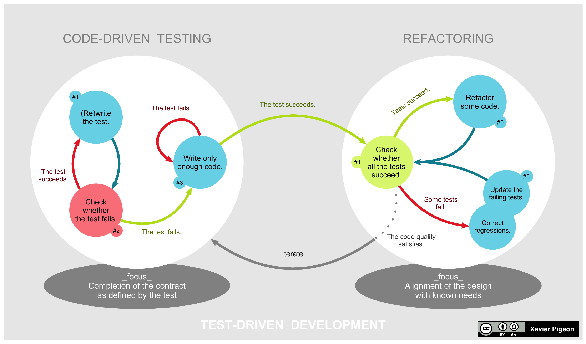

## Table of Contents
- [Background](#background)
- [TDD](#tdd)

---

## Background
I've been working with Codex for a bit less than a year now; both cloud (github repos) and vscode extension for local codebases. it's been one hell of a journey, specially since "Thinking" came out. more recently you can also read explanation of what the agent is doing in real-time, asking to run commands, `find`ing code snippets, managing files and permissions, basically everything. I never liked to "sit in the copilot seat" when using agents for writing code, I wanted to be the supervisor. the more I know about the inner workings and *thinking* [^1] process, the more I am in charge, thus more aware of what trajectory the development is taking.

I've noticed some interesting (to say the least) patterns in the way Codex approaches tasks. they pop up in different stages: understanding the problem, finding relevant piece of code, testing, documentation, file creation, folder structures, etc. I'll try to list some of the important, reoccurring ones I've noticed

# TDD
Red, Green, Refactor.
You want a new feature, write a test for it before writing any code. it should fail since there's no feature yet: Red
Then write the code, only enough to pass the test you wrote: Green
Go back and refactor your test, and your code: Refactor

The first obvious outcome here is that you can ensure that you're writing test-able code. code that can be individually be run, analyzed, and debugged.

---

## Takeaways

1. Code is a great medium to sketch with, even when it’s not doing “real work”.

---

## Footnotes

[^1]: to write is to think